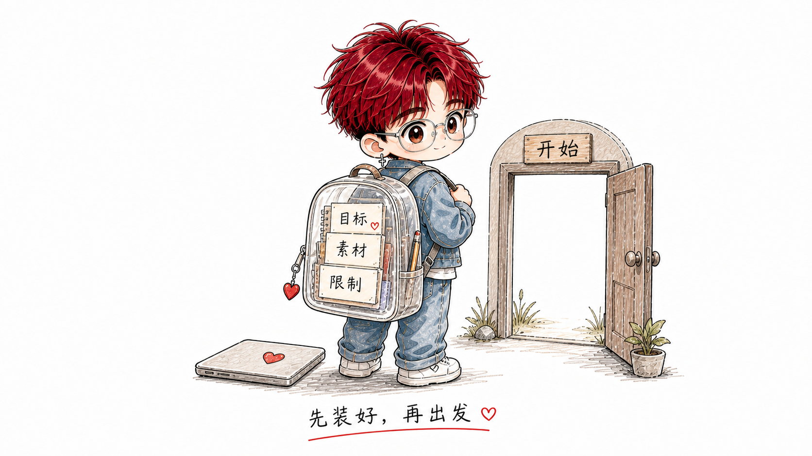
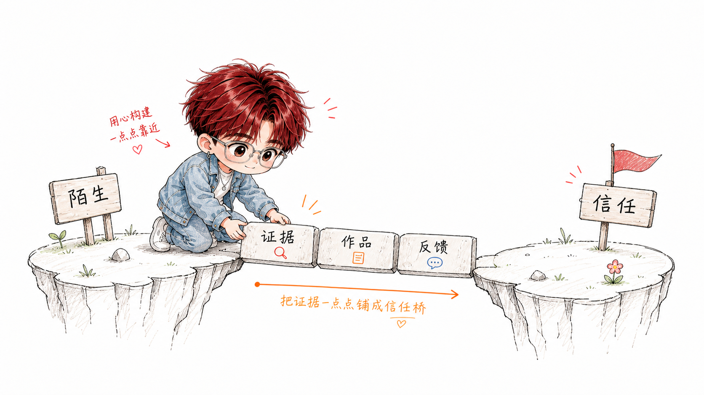
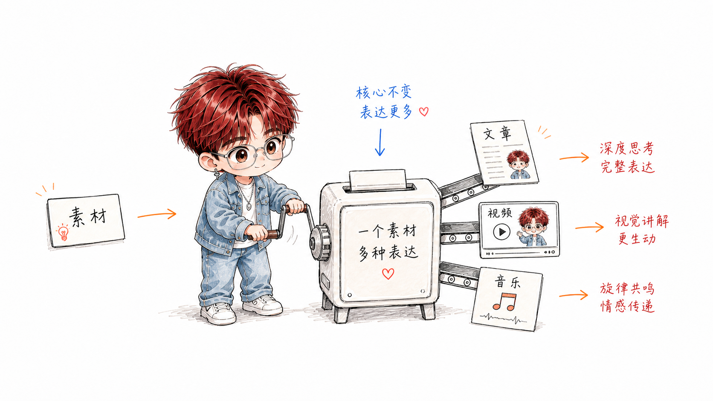

# YC_IP Illustrations

> 用 YC 的 IP 角色为任何内容生成配图。默认对齐当前 examples/images 的 Sample 成品风格；只有明确点名 Minimal / Sticker / 贴图纸 / 贴纸 / 极简时才做最小贴纸，只有明确点名 Rich 时才做完整海报 / IP 设定页。
>
> 三种模式（Sample / Minimal / Rich）| 多比例支持 | YC chibi 角色（红发透明眼镜）| 必带参考图工作流 | Codex Skill

---

## 这个仓库是什么

YC_IP Illustrations 是一个 Codex Skill，用来指导 AI Agent 用 YC 的固定 IP 角色生成个人品牌配图。

它不是通用插画 prompt，也不是 PPT 模板。核心目标是：把任何内容（YC 的5大主题方向，或任意知识主题）用 YC 的视觉风格和角色呈现出来，生成一张有 YC 品牌识别度的图。

默认视觉 IP 是「YC」：一个红发蓬松、戴透明圆框眼镜、chibi 比例的年轻人角色。YC 不是吉祥物，不是装饰，而是正在认真探索世界、build 东西、创作音乐、持续学习的真实年轻人缩影。

一句话：**让每一张图都有 YC 的识别度，让内容和角色浑然一体。**

---

## 最短用法规则

用户不需要写长 prompt。只要说：

```text
用这个 skill 的风格解释 Machine Learning
```

默认就应该生成 **Sample / Standard Broad Concept Explainer**：

- 不是百科信息图，不是课程卡片，不是 PPT。
- 只画一个核心隐喻：输入材料 → YC 操作/学习/处理 → 输出结果。
- 只保留 3-4 个中文短标注。
- 不要定义段落、分类列表、真实公司案例、底部总结条、section header。
- 只有明确说“贴图纸 / 贴纸 / Sticker / Minimal / 极简”才做 Minimal。
- 只有明确说“Rich / 完整海报 / IP 设定页 / 品牌全景”才做 Rich。

例：解释 Machine Learning 时，画 YC 把很多“数据”卡片放进“学习机器”，机器找规律，输出“预测”卡片。

---

## 三种输出模式（核心）

这个 skill 不是单一风格，而是一个**从轻到重的密度光谱**。默认走当前 samples 的中等密度，避免平时输出太轻，也避免做成满版海报。

默认模式是 **Sample / Standard**：对齐 `examples/images` 和 `YC_IP/assets/examples/simple/current-showcase/` 的成品风格，适合日常文章配图、社媒单图、标题图、知识讲解和方法类图。Minimal 和 Rich 都不自动启用，只有用户明确说“Minimal / Sticker / 贴图纸 / 贴纸 / 极简 / 最小贴纸”或“Rich / 完整海报 / IP 设定页 / 品牌全景”才启动。

| | Minimal / Sticker（仅显式点名） | Sample / Standard（默认） | Rich 丰富（仅显式点名） |
|---|---|---|---|
| **样子** | 白底水彩铅笔小贴纸，单角色 | 当前 examples/images 的成品图 | 满版 editorial，多面板 |
| **画风** | 水彩铅笔轻涂松手绘 | 温暖手绘 chibi 插画 | 精致 editorial 插画 |
| **背景** | 纯白 | 纯白 | 奶油白 |
| **文字** | 0-3 个中文短词 | 中文短标注，中等密度 | 中英混排，多标注 |
| **何时用** | 仅显式点名：贴图纸、贴纸、极简、minimum | 默认：文章正文配图、社媒单图、封面/标题、流程、知识讲解 | 仅显式点名：完整海报、IP 自我介绍、品牌全景、整页设定图 |

**模式口诀**：

- 用户没指定 → **Sample / Standard**
- 用户明确说 **Minimal / Sticker / 贴图纸 / 贴纸 / 极简 / 最小贴纸** → Minimal
- 用户明确说 **Rich / 完整海报 / IP 设定页 / 品牌全景** → Rich

> **Minimal 和 Rich 都是显式模式，不参与自动判断。** 日常文章、正文配图、社媒和封面默认都走 Sample / Standard。

想手动指定时直接说模式词即可：「用 minimal/sticker 画…」「默认 sample 风格…」「来个 rich 的 IP 介绍」。

---

## 生图必须带参考图（最重要的稳定性技巧）

纯文字 prompt 不稳，模型会回退到"精致全彩 anime + 满版拼贴"的海报先验。**每次生图都附一张参考图。**

参考图同时锁三件事：**①YC 长相 ②画风渲染 ③信息密度**。

- Sample / Standard 默认模式 → 附 `YC_IP/assets/examples/simple/current-showcase/` 里最接近任务的例图。
- Minimal / Sticker 模式 → 固定附 `YC_IP/assets/examples/sticker/00-reference-sheet-watercolor.png` 作为 canonical 画风锁；动作图只作构思参考。
- Rich 模式 → 仅用户显式点名时，附 `YC_IP/assets/examples/rich/` 里最接近的整页例图。
- 只想锁角色长相 → 附 `character-reference/` 里的九宫格（注意：九宫格是全彩，只能锁长相、锁不了水彩画风）。

第一次仍可能偏 → 正常，带参考图重生成第二次就对。换 prompt 里的「动作/场景」那一行，就是同一个 YC 干不同的事。

---

## 适合什么场景

**最适合：**

- 为 YC 的原创文章、知识帖、小红书/B站内容生成干净的正文配图与封面
- 想要统一视觉风格、固定 IP 角色的个人品牌内容创作者
- 需要多比例配图（16:9 文章 / 1:1 社媒 / 9:16 竖版 Story 等）
- 想要统一、留白干净、像当前 examples 那样的手绘个人 IP 配图（而不是信息塞满的海报）

**不适合：**

- 想要商业品牌 KV 或精修商业插画的人
- 想要严格可编辑矢量源文件的人
- 想要大量文字塞满画面的信息图的人

---

## 它会产出什么

- 指定比例的 YC IP 配图（支持 8 种比例）
- 文章/内容的 shot list（每张图的主题、模式、YC 动作、标注建议）
- 最终 PNG，保存到 `assets/<content-slug>/`

**支持的图片比例：**

| 比例 | 用途 |
|------|------|
| `16:9` | 文章配图、博客 banner、B站封面 |
| `1:1` | Instagram、小红书方图、通用社媒 |
| `9:16` | Story、抖音竖版、朋友圈竖图 |
| `4:3` | 传统横版、部分平台帖子 |
| `3:2` | 横版照片风格、博客图 |
| `2:3` | Pinterest、竖版海报 |
| `5:4` | 微博/部分平台方形偏横 |
| `21:9` | 超宽 banner、网站 header |

**不输出：** PPTX / PDF / 可编辑源文件、商业插画 KV、无 YC 角色的通用插画。

---

## 示例效果

这组是当前默认 Sample 成品样例：方法不是旁边的流程线，而是被画成 YC 正在操作的真实场景物件。安装后的 skill 内部也同步了一份到 `YC_IP/assets/examples/simple/current-showcase/`，作为最终成品风格基准。

### 找回上下文


### 信任桥


### 按用途分拣


### 一份素材，多种表达


这些图片是成品展示样例。使用时优先学习它们的处理方式：YC 参与核心动作，方法变成桥、机器、分拣装置或输出装置；不要做成 PPT 流程图，也不要把角色贴在白色小方块里。

### 封面版


### 社媒 1:1


---

## 安装

```bash
git clone https://github.com/<your-github>/YC_IP.git
cd YC_IP
mkdir -p "${CODEX_HOME:-$HOME/.codex}/skills"
cp -R ./YC_IP "${CODEX_HOME:-$HOME/.codex}/skills/"
```

安装后，在 Codex 里使用：

```text
Use $YC_IP 为这篇内容生成 YC 风格配图。
```

如果你的客户端支持 slash skill，也可以直接呼叫 `/YC_IP`。

---

## 怎么用

### 配图策略（先不生图）

```text
Use $YC_IP 先不要生图。
分析下面这篇文章哪里值得配图，输出 shot list。
每张图写清楚：段落位置、主题、核心意思、用哪个模式、YC 在做什么、建议比例、建议标注词。

<粘贴文章>
```

### 文章正文配图（默认 Sample）

```text
Use $YC_IP 为下面这篇文章配几张图（默认 Sample 风格，对齐当前 examples）。

<粘贴文章>
```

### 单个概念 / 情绪（默认 Sample）

```text
Use $YC_IP 画一张 1:1 图，主题「专注写作」，YC 正在把注意力收回到笔记本上。
```

### Minimal / Sticker 极简图（显式点名）

```text
Use $YC_IP 明确使用 Minimal / Sticker，画一张「专注写作」的极简贴纸图，1:1。
```

### 文章封面 / 标题图（默认 Sample 封面版）

```text
Use $YC_IP 给这篇文章做个 16:9 封面，标题「我是怎么搭出个人 IP 的」。
一个 YC hero + 一行标题 + 白底，干净不堆元素。
```

### 流程 / 步骤（默认 Sample）

```text
Use $YC_IP 把这个学习方法画成 16:9 场景图：把方法变成可操作的物件，YC 正在里面操作，纯白背景，对齐当前 examples。
```

### IP 自我介绍（Rich）

```text
Use $YC_IP 生成一张 16:9 的 YC IP 介绍图，展示 YC 是谁、关注什么、在做什么。明确使用 Rich 模式。
```

更多示例见 [examples/prompts.md](examples/prompts.md)。

---

## 工作流程

1. 读取用户给的内容（文章/帖子/想法/知识主题）
2. 先提"认知锚点"——只给核心判断/转折/对比/闭环配图，够用就好，不做画册
3. 默认使用 Sample / Standard；Minimal 和 Rich 只有用户明确点名才启用
4. 取对应模式的参考图
5. 每张图单独调用图像模型生成（带参考图）
6. QA 检查：红发 + 透明眼镜（所有模式必须）；按模式查背景与密度（详见 `references/qa-checklist.md`）
7. 保存 PNG，报告用途、模式和路径

---

## 目录结构

```text
.
├── README.md
├── LICENSE
├── examples/
│   ├── images/                  # README 成品展示图
│   └── prompts.md               # 更多使用示例
└── YC_IP/                       # Codex Skill 主体（需要安装的就是这个）
    ├── SKILL.md
    ├── agents/
    │   └── openai.yaml
    ├── assets/
    │   └── examples/            # 风格校准 + 参考图，按模式分文件夹
    │       ├── sticker/         # Minimal/贴图纸：白底水彩贴纸（含动作 + 穿搭变体）
    │       ├── simple/          # 多步场景流 / 干净标题图
    │       │   └── current-showcase/  # 当前 examples/images 成品风格基准
    │       ├── cover/           # 16:9 Sample 封面版样例
    │       ├── social/          # 1:1 社媒单图样例
    │       ├── rich/            # 满版 editorial（IP/品牌）
    │       └── character-reference/  # 九宫格：锁角色长相 + 姿势库（浏览挑姿势）
    └── references/
        ├── style-dna.md         # 三模式风格 DNA、防海报护栏
        ├── yc-character.md      # YC 角色外形、服装、生图关键词（含贴图轻渲染版）
        ├── yc-brand-identity.md # 5大内容支柱、人设、signature quotes
        ├── composition-patterns.md
        ├── prompt-template.md   # 三模式 prompt + 封面版 + 参考图工作流
        └── qa-checklist.md      # 按模式的生成后检查
```

---

## 注意事项

- YC 必须有**红发**和**透明圆框眼镜**，缺一不可，否则角色识别失败需重生成
- **每次生图都带参考图**，这是稳定性的关键
- 一张图只讲一件事，宁可多出几张轻图，也不要一张塞满
- 背景按模式：**Minimal / Sample 都用纯白**；Rich 才允许奶油白或轻纸感。别套错（文章配图一旦变成整张暖色纸底，会显得不够干净）
- **Rich 必须显式点名才启用**；普通文章封面、正文配图、社媒图不要自动升级到 Rich
- `assets/examples/` 只用来锁画风和角色，不要照抄具体构图
- AI 图像模型可能出现角色漂移（发色不对/眼镜丢失），生成后需检查
- 中文标注越短越稳定

---

## 关于 YC

**YC (Yichen)** — AI Builder / Music Creator / Always Learning

用创意和技术 build 有意思的东西。

- 内容方向：AI 工具 × 个人成长 × 音乐创作 × 设计创意 × 留学生活
- 平台：小红书 / B站 / YouTube / Instagram
- Motto：认真生活，浪漫创作。♥

---

## License

MIT License. See [LICENSE](LICENSE).
