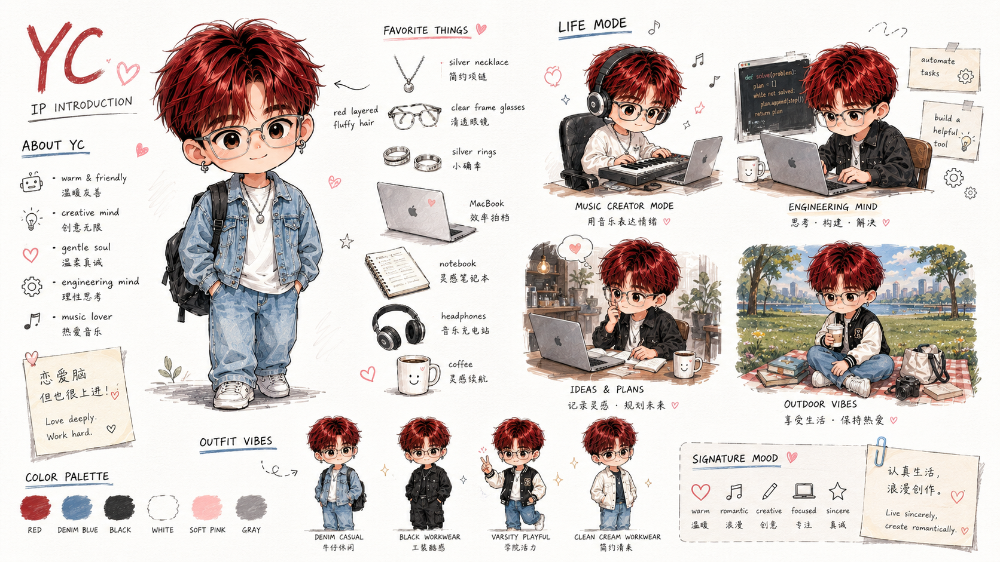
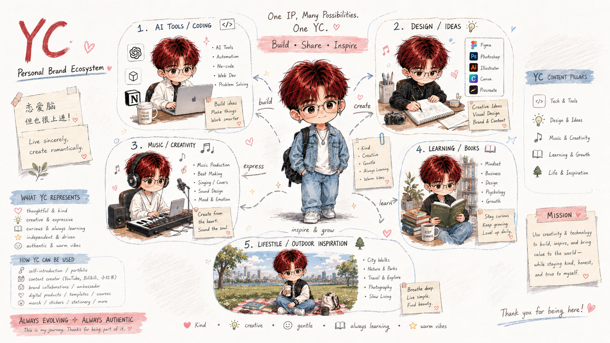
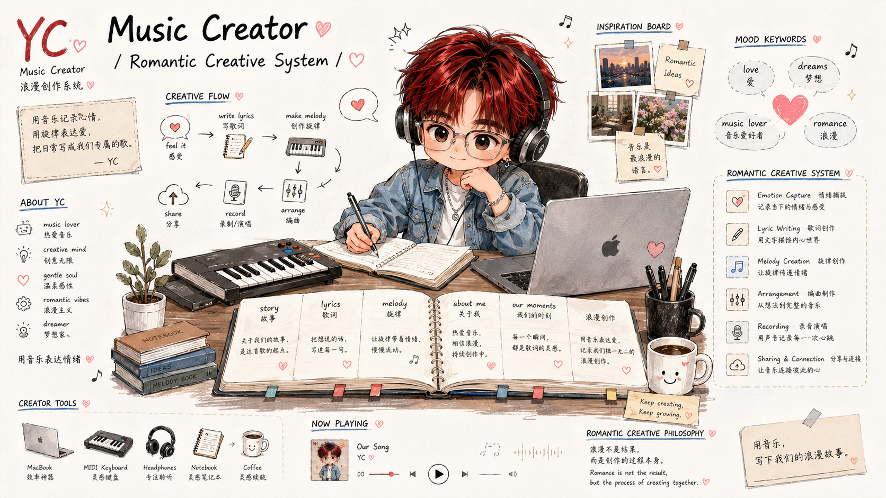
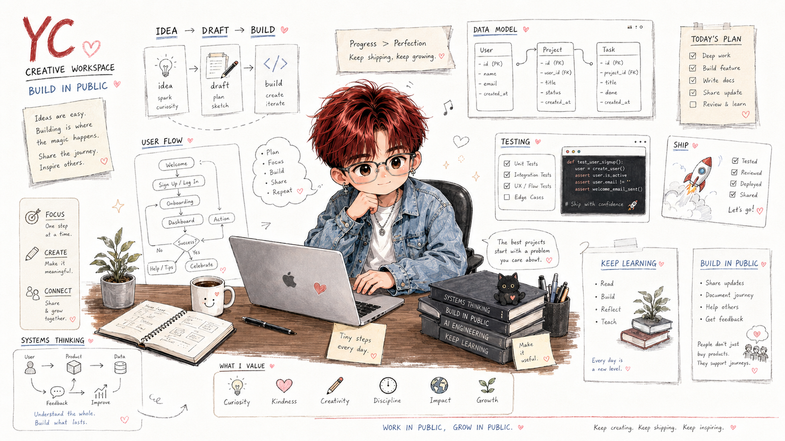
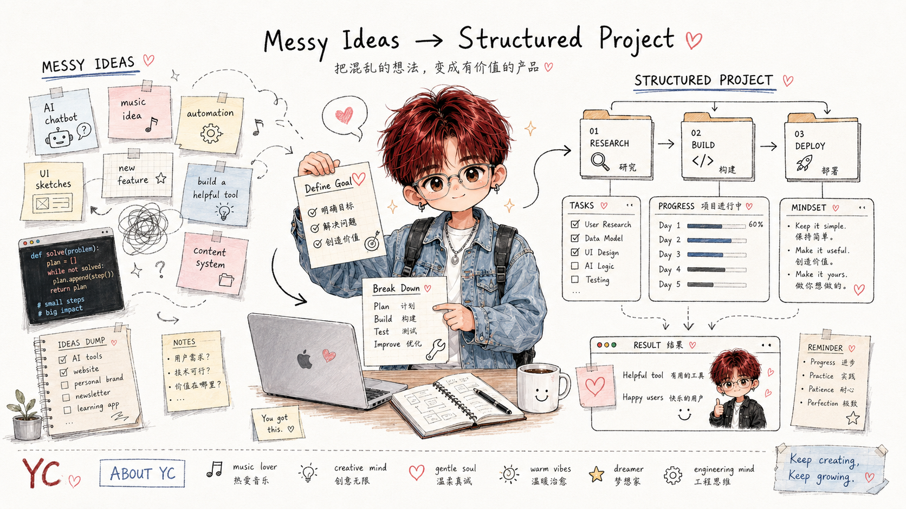

# YC Personal IP Illustrations

> 用 YC 的 IP 角色为任何内容生成温暖手账风格的配图。
>
> 多比例支持 | YC chibi 角色（红发透明眼镜）| 温暖 editorial 风格 | 中英混排 | Claude Code Skill

---

## 这个仓库是什么

YC Personal IP Illustrations 是一个 Claude Code Skill，用来指导 AI 用 YC 的固定 IP 角色生成个人品牌配图。

它不是通用插画 prompt，也不是 PPT 模板。它的核心目标是：把任何内容（YC 的5大主题方向，或任意知识主题）用 YC 的视觉风格和角色呈现出来，生成一张有 YC 品牌识别度的图。

默认视觉 IP 是「YC」：一个红发蓬松、戴透明圆框眼镜、chibi 比例的年轻人角色。YC 不是吉祥物，不是装饰，而是正在认真探索世界、build 东西、创作音乐、持续学习的真实年轻人缩影。

一句话：**让每一张图都有 YC 的识别度，让内容和角色浑然一体。**

---

## 适合什么场景

**最适合：**

- 为 YC 的原创文章、知识帖、小红书/B站内容生成配图
- 想要统一视觉风格的个人品牌内容创作者
- 需要多比例配图（16:9 文章 / 1:1 社媒 / 9:16 竖版 Story 等）
- 想用固定 IP 角色覆盖不同内容场景的人
- 用 Claude Code 做内容生产，希望稳定复用一套视觉语言的人

**不适合：**

- 想要纯极简白底草图风格、无角色的通用配图的人
- 想要商业品牌 KV 或精修商业插画的人
- 想要严格可编辑矢量源文件的人
- 想要大量文字塞满画面的信息图的人

---

## 它会产出什么

**默认输出：**

- 指定比例的 YC IP 配图（支持 8 种比例）
- 文章/内容的 shot list（每张图的主题、布局、YC 动作、标注建议）
- 最终 PNG，保存到 `assets/<content-slug>/`

**支持的图片比例：**

| 比例 | 用途 |
|------|------|
| `16:9` | 文章配图、博客 banner、B站封面 |
| `1:1` | Instagram、小红书方图、通用社媒 |
| `9:16` | Story、抖音竖版、朋友圈竖图 |
| `4:3` | 传统横版、部分平台帖子 |
| `3:2` | 横版照片风格、博客图 |
| `2:3` | Pinterest、竖版海报 |
| `5:4` | 微博/部分平台方形偏横 |
| `21:9` | 超宽 banner、网站 header |

**不输出：**

- PPTX / PDF / 可编辑源文件
- 商业海报或封面 KV
- 无 YC 角色的通用插画

---

## 视觉风格

**温暖手账 editorial**：像一个认真生活、浪漫创作的年轻人把想法铺在一张漂亮的笔记页上。

- 奶油白背景（不是纯白）
- chibi YC 角色（红发 + 透明眼镜，缺一不可）
- 中英混排标注，section header 用小标题排版
- 签名道具：MacBook（♥ 贴纸）、笑脸咖啡杯 ☺、MIDI 键盘、植物
- 装饰元素：小心形 ♥、音符 ♪、星星 ✦（克制使用）
- 多面板 editorial 布局，信息有层次但不死板
- 温暖有品味，不是 PPT，不是商业海报，不是幼稚卡通

**YC 的5大内容方向：**

1. AI Tools / Coding — AI 工具、自动化、Web Dev、问题拆解
2. Design / Ideas — 创意思维、视觉设计、内容系统
3. Music / Creativity — 音乐创作、情绪表达、创作系统
4. Learning / Books — 成长方法论、学习框架、阅读笔记
5. Lifestyle — 城市生活、户外探索、留学视角、慢生活

另外还支持任意知识主题讲解（数学、科学、历史等），用 Knowledge Explainer 布局类型。

---

## 示例效果

### IP 角色介绍


### AI 主题配图


### 音乐创作主题


### Build / 创作主题


### 想法到结构


> 这些图片是风格校准样例。使用时应该从当前内容重新设计场景，不要直接复刻已有构图。

---

## 安装

克隆仓库：

```bash
git clone https://github.com/<your-github>/yc-personal-ip.git
cd yc-personal-ip
```

复制 skill 到 Claude Code skills 目录：

```bash
cp -R ./yc-personal-ip ~/.claude/skills/yc-personal-ip
```

安装后，在 Claude Code 或 claude.ai 里使用：

```text
/yc-personal-ip
```

---

## 怎么用

### 配图策略（先不生图）

```text
/yc-personal-ip 先不要生图。
分析下面这篇文章哪里值得配图，输出 shot list。
每张图写清楚：段落位置、主题、核心意思、布局类型、YC 在做什么、建议比例、建议标注词。

<粘贴文章>
```

### 生成文章横版配图

```text
/yc-personal-ip 帮我为下面这篇文章生成 4 张 16:9 的 YC 风格配图。

<粘贴文章>
```

### 生成社媒竖版图

```text
/yc-personal-ip 生成一张 9:16 的 Story 配图，内容是关于「每天进步一点点」的感悟。
```

### 生成 IP 自我介绍图

```text
/yc-personal-ip 帮我生成一张 16:9 的 YC IP 介绍图，展示 YC 是谁、关注什么、在做什么。
```

### 用 YC 讲解知识概念

```text
/yc-personal-ip 用 YC 的风格生成一张 16:9 的图，讲解「什么是递归」。
YC 在黑板前讲解，有清晰的示例和中英混排标注。
```

### 生成品牌生态地图

```text
/yc-personal-ip 生成一张 21:9 的超宽版 YC 品牌生态图，展示 YC 的5大内容支柱和整体定位。
```

更多示例见 [examples/prompts.md](examples/prompts.md)。

---

## 7种布局类型

| 类型 | 适合场景 |
|------|------|
| IP Character Sheet | 自我介绍、角色设定、IP 展示 |
| Creative Workspace Panorama | 创作工作台、Build in Public |
| Brand Ecosystem Map | 品牌介绍、内容支柱展示 |
| Deep Work Journal | 单主题深度内容（音乐系统/学习方法） |
| Process Transformation | 混乱到有序、Before/After |
| Knowledge Explainer | 任意知识讲解（数学/科学/概念） |
| Social Media Card | 社媒单张（小红书/Story/朋友圈） |

---

## 工作流程

1. 读取用户给的内容（文章/帖子/想法/知识主题）
2. 判断内容方向和合适的布局类型
3. 输出 shot list：每张图只表达一个核心结构
4. 按内容选择 YC 的服装、道具和场景
5. 每张图单独调用图像模型生成
6. QA 检查：红发+透明眼镜（必须）、奶油白背景、签名道具、中英混排
7. 保存 PNG，报告用途和路径

---

## 目录结构

```text
.
├── README.md
├── LICENSE
├── .gitignore
├── assets/                      # 品牌素材（角色设计图等）
├── examples/
│   ├── images/                  # 生成结果展示
│   └── prompts.md               # 更多使用示例
└── yc-personal-ip/              # Claude Code Skill 主体
    ├── SKILL.md
    ├── agents/
    │   └── openai.yaml
    ├── assets/
    │   └── examples/            # 风格校准参考图
    └── references/
        ├── style-dna.md
        ├── yc-character.md
        ├── yc-brand-identity.md
        ├── composition-patterns.md
        ├── prompt-template.md
        └── qa-checklist.md
```

真正需要安装到 Claude Code 的是：

```text
yc-personal-ip/
```

根目录的 README、LICENSE 和 examples 是 GitHub 分享文档。

---

## 注意事项

- YC 必须有**红发**和**透明圆框眼镜**，缺一不可，否则角色识别失败需重生成
- 每张图只讲一个核心结构或场景，不要信息过载
- 背景是奶油白，不是纯白；如果生成纯白背景需重生成
- MacBook（心形贴纸）和笑脸杯是工作/创意场景的签名道具，不要省略
- AI 图像模型可能出现角色漂移（发色不对/眼镜丢失），生成后需检查
- 中文标注越短越稳定；中英混排效果优于纯中文

---

## 关于 YC

**YC (Yichen)** — AI Builder / Music Creator / Always Learning

用创意和技术 build 有意思的东西。

- 内容方向：AI 工具 × 个人成长 × 音乐创作 × 设计创意 × 留学生活
- 平台：小红书 / B站 / YouTube / Instagram
- Motto：认真生活，浪漫创作。♥

---

## License

MIT License. See [LICENSE](LICENSE).
